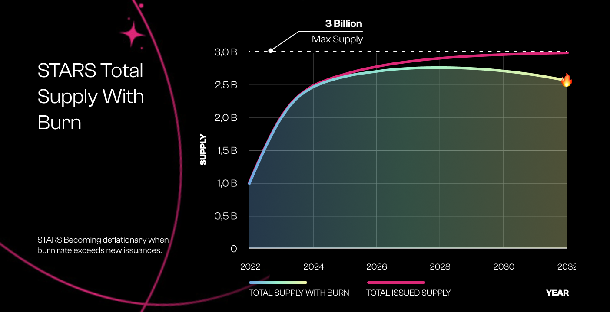

# Creating a Burn to Mint Collection

This guide will cover all the steps of creating a Burn to mint Collection on Stargaze Studio.

<figure><figcaption>
The Burn to Mint collection configuration page.
</figcaption></figure>

A Burn to Mint Collection is a collection of up to 10,000 unique NFTs that utilizes the Stargaze burn to mint function alongside the randomized minter. Instead of accepting fungible tokens like STARS or ATOM to mint, Burn to Mint collections **require an existing NFT to be burned in order to mint**.\
\
When creating the collection, the creator selects which collections are eligible to participate in the burn process and the user selects NFTs from those collections to burn when participating in the mint.

To begin creating a collection, ensure that the following steps have been taken:\
\
1\) You are connected to testnet at [studio.publicawesome.dev](https://studio.publicawesome.dev)\
2\) Your wallet is connected on the top left of the screen\
3\) You have testnet tokens in your address. Testnet tokens can be requested in the #faucet channel of the [Stargaze Discord](https://discord.gg/stargaze).
