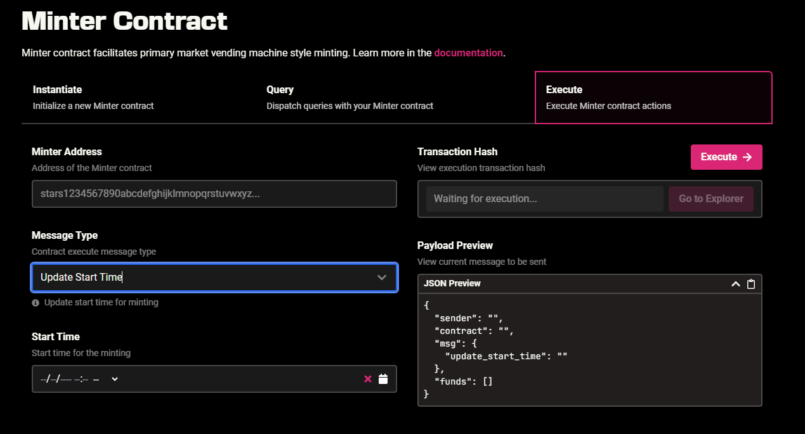

# Info for Featured Projects

Congratulations on getting picked! 🎉 Being featured on Stargaze is such a joyful moment for us all!

If you are a dev/familiar with code, you can use **CLI** to launch. If not you can use **Studio**, our no-code tool developed by DeusLabs to make launching as easy as possible for everyone.

This guide will be divided into 2 colors: 🔸CLI and 🔹Studio.

####

#### 🔸 Deploying via CLI (Stargaze-tools)

Launch a collection through CLI following these steps:

[https://docs.stargaze.zone/guides/readme](https://docs.stargaze.zone/guides/readme)

Step-by-step walkthrough:

[https://www.youtube.com/watch?v=lw6w5zlRj14](https://www.youtube.com/watch?v=lw6w5zlRj14)

****

**🔹 Deploying via Stargaze Studio**

Launch via Studio Guideline:

[https://docs.stargaze.zone/guides/stargaze-studio](https://docs.stargaze.zone/guides/stargaze-studio)

Mainnet:

[https://studio.stargaze.zone/](https://studio.stargaze.zone/)

Testnet:

[https://studio.publicawesome.dev/](https://studio.publicawesome.dev/)

Here are some **best practices** after you get picked:

* The moment you have your collection ready, you need to **start testnet tryouts**. (Even if you are using Studio). That is to ensure you are familiar with it, as well as to reduce any chances of doing things incorrectly that could lead to getting your collection burned.
* **Try testnet a lot of times.** When you get picked, you WILL have to go through testnet, no exceptions. That means, it’s better to do it sooner rather than later. Even if you are an experienced dev, it needs some practice, so don’t skip until the last moment. Test on testnet in all possible scenarios: mint with WL and public, send airdrops, burn NFTs. Everything that you want to do on mainnet, needs to get done on testnet first. After you deploy on the mainnet, it is forever on the chain, so be very careful! SG team can hide on frontend if the deployment was incorrect, but the collection will still exist on chain. You will also need to mint and burn your whole bad collection (to avoid having two identical collections), so it will appear on hubble for example when you are minting and burning.
* Final testnet is to be done with your **whole collection**, not a part or sample images. SG team needs to check if the images and metadata aren’t corrupted, so you need to put your whole collection there, as it should be on mainnet. There is a “checker” that will be run by SG devs for that purpose, so have your testnet link ready in a timely manner (the week before the mint for example).
* Uploading large amounts of images or high res images can take a lot of time, sometimes many hours. Be prepared to let it sit on your computer while the upload is being done. That means, account also for that time when deploying. On that note, **pinning images** can take time as well. Since it is uploaded on IPFS, it will need to be “pinned” so it appears on SG website. The pinning resolves itself after a while.

#### DMCA

Projects that get picked cannot have any copyrighted materials. Fanart/homages/references to famous tv shows/movies/games/series need to be taken away from the project in order to be launched on SG. If a project gets a DMCA Notice (be it featured or not), it will need to be taken down from the frontend. If SG doesn’t comply, it risks losing their host. In order to avoid even getting the DMCA Notice, no copyright materials are allowed. This is a very serious matter, and will be checked before authorization to be on the featured launchpad.

****

#### **Immutable contracts: Things you can change/can’t change**

* Right now, there is no way to change images or metadata from a collection. You may change the following (not an exhaustive list) after deployment:

Update start time (if the mint hasn’t started yet)

🔸 **** On CLI: update start time in config.json:

&#x20;   `yarn minter --update-start-time`

🔹 On Studio: Minter Contract > Execute > Message Type : Update Start Time

<figure><figcaption></figcaption></figure>

Add a WL address (before or while WL is active)

🔸 On CLI: run the following command on terminal:

&#x20;   `yarn whitelist --add 'address1,address2,address3,...address100'`

🔹 On Studio: Whitelist Contract > Execute > Message type: Add Members

<figure><figcaption></figcaption></figure>

Update max amount of mints from a wallet

🔸 (replace “4” for the number you wish)

&#x20;    __     `yarn minter --per-address-limit 4`

🔹 On Studio: Minter Contract > Execute > Message Type : Update Per Address Limit

<figure><figcaption></figcaption></figure>

#### Frequent problems/questions

**Public mint time**

The public mint time will be on Friday, at 7pm UTC. Example, if launched on July, 22nd:

🔸 startTime: '2022-07-22T19:00:00.000Z',

🔹 On Studio: you need to do some math, since Studio takes your local time.

_\*If you have a WL, Public mint time starts together with your WL._

****

**WL mint time**

WL mint time is prior to public mint time, can be as far as a day before public.

WL end time should always be Friday, at 7pm UTC.

Tool for checking the correct time:[http://www.timestamp-converter.com/](http://www.timestamp-converter.com/)

****

**WL limit (20%)**

Your collection (if featured) needs to have at most **20% of mintable NFTs for WL** (multiply addresses on WL with number of NFTs to mint on WL). That also means airdrops should be considered “non-mintable”. Example:

1000 NFTs - 0 airdrops - 100 WL addresses - 2 mints per WL ✅

1000 NFTs - 0 airdrops - 200 WL addresses - 1 mint per WL ✅

1000 NFTs total, but with 500 airdrops - 100 WL addresses - 1 mint per WL ✅

“The idea behind the limit is to leave a good amount for public sale. We know not everyone buys the max on WL but it should also help creators design the WL and choose the WL addresses more comprehensively.”

**Uploading metadata correctly linking to images**

🔸 Use the script provided (rather than uploading your images manually) so it will automatically change your metadata to include the IPFS link to images.[https://docs.stargaze.zone/guides/readme/3.-add-assets-and-metadata/3.-add-assets-and-metadata](https://docs.stargaze.zone/guides/readme/3.-add-assets-and-metadata/3.-add-assets-and-metadata)

🔸 Alternatively, you can replace with the correct link after you upload your images, using vs code - find and replace:

[https://stackoverflow.com/questions/37346481/how-do-i-find-and-replace-all-occurrences-in-all-files-in-visual-studio-code](https://stackoverflow.com/questions/37346481/how-do-i-find-and-replace-all-occurrences-in-all-files-in-visual-studio-code)

🔸 (Simple steps: upload images; get the IPFS link to that; go to vs code; find and replace all occurrences with the new link; save all; upload your metadata to IPFS).

****

**Minting gave an error:**

Usually there are problems with your metadata. Check this tool to find possible issues: [https://jsonlint.com/](https://jsonlint.com/)

(copy and paste your metadata here)

Another issue is having the link (basetokenURI) written incorrectly, check if the link is a valid one.

Do NOT use a “/” at the end of your base token URI link.

****

**Images not showing, although the NFT page itself is there:**

Possibly it has to do with pinning from IPFS (images need a while to be pinned and available, so they might not show right away). Usually the more accesses the image has had, it gets “recorded” and pinned. So try to access the images a few times as well while waiting. Also, double check the link on metadata, it should look like this:

"image": "ipfs://bafybeih3ykpa42eipgtzcrfkeo5nvazcdqhj3oh3ztju44tcoipzsdaauy/images/1.png",

(common mistake is adding the "https://ipfs.io/…” before the base token uri. It should be written as above)

****

**Something is not working as it should/it was before**

It might be that the code you have right now is outdated.

🔸 Run the command below to get the latest version for stargaze tools:

&#x20;    __     `git pull`

🔹 For Studio, also check if you are using the lastest version by doing a hard refresh on Studio page. (Ctrl+F5)
