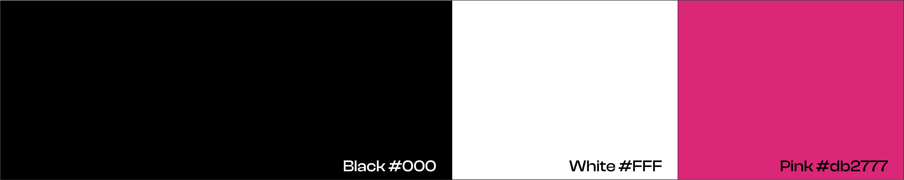

# Stargaze Assets

### Color Palette

<figure><figcaption></figcaption></figure>

* Black #000000
* White #ffffff
* Pink #db2777

### Typeface Logo

<figure><figcaption></figcaption></figure>

| Color    | Size              | Type | Download Link                                                                                            |
| -------- | ----------------- | ---- | -------------------------------------------------------------------------------------------------------- |
| Gradient | 500 x 101 pixels  | PNG  | [Download](https://github.com/public-awesome/assets/blob/main/Stargaze%20Logo%20Gradient%20\(500\).png)  |
| Gradient | 2000 x 403 pixels | PNG  | [Download](https://github.com/public-awesome/assets/blob/main/Stargaze%20Logo%20Gradient%20\(2000\).png) |
| Gradient | -                 | SVG  | [Download](https://github.com/public-awesome/assets/blob/main/Stargaze%20Logo%20Gradient%20SVG.svg)      |
| White    | 500 x 101 pixels  | PNG  | [Download](https://github.com/public-awesome/assets/blob/main/Stargaze%20Logo%20White%20\(500\).png)     |
| White    | 2000 x 403 pixels | PNG  | [Download](https://github.com/public-awesome/assets/blob/main/Stargaze%20Logo%20White%20\(2000\).png)    |
| White    | -                 | SVG  | [Download](https://github.com/public-awesome/assets/blob/main/Stargaze%20Logo%20White%20SVG.svg)         |

### Star Symbol Logo

<figure><figcaption></figcaption></figure>

| Color    | Size               | Type | Download Link                                                                                              |
| -------- | ------------------ | ---- | ---------------------------------------------------------------------------------------------------------- |
| Pink     | 500 x 500 pixels   | PNG  | [Download](https://github.com/public-awesome/assets/blob/main/Stargaze%20Pink%20Symbol%20\(500\).png)      |
| Pink     | 2000 x 2000 pixels | PNG  | [Download](https://github.com/public-awesome/assets/blob/main/Stargaze%20Pink%20Symbol%20\(2000\).png)     |
| Pink     | -                  | SVG  | [Download](https://github.com/public-awesome/assets/blob/main/Stargaze%20Pink%20Symbol%20SVG.svg)          |
| White    | 500 x 500 pixels   | PNG  | [Download](https://github.com/public-awesome/assets/blob/main/Stargaze%20White%20Symbol%20\(500\).png)     |
| White    | 2000 x 2000 pixels | PNG  | [Download](https://github.com/public-awesome/assets/blob/main/Stargaze%20White%20Symbol%20\(2000\).png)    |
| White    | -                  | SVG  | [Download](https://github.com/public-awesome/assets/blob/main/Stargaze%20White%20Symbol%20SVG.svg)         |
| Gradient | 500 x 500 pixels   | PNG  | [Download](https://github.com/public-awesome/assets/blob/main/Stargaze%20Gradient%20Symbol%20\(500\).png)  |
| Gradient | 2000 x 2000 pixels | PNG  | [Download](https://github.com/public-awesome/assets/blob/main/Stargaze%20Gradient%20Symbol%20\(2000\).png) |
| Gradient | -                  | SVG  | [Download](https://github.com/public-awesome/assets/blob/main/Stargaze%20Gradient%20Symbol%20SVG.svg)      |

### Pixel Star (old logo)

<figure><figcaption></figcaption></figure>

