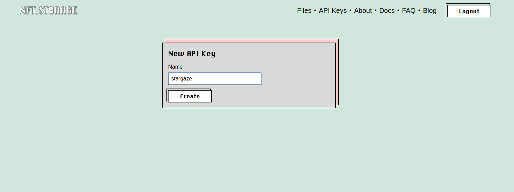
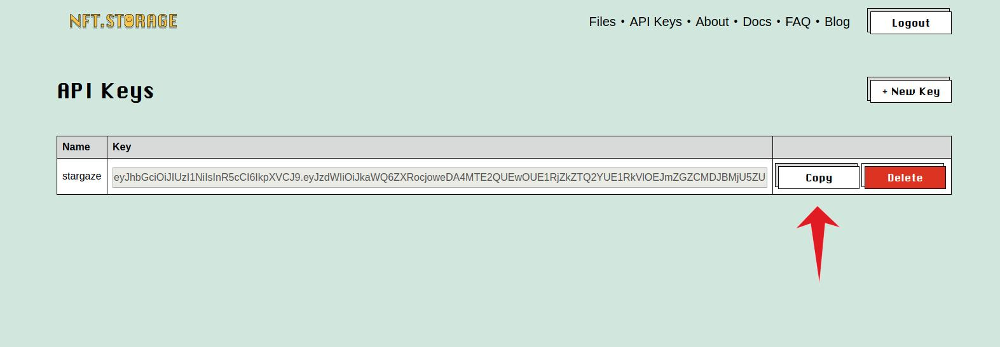

# NFT.storage (script)

In this guide, we will be using [NFT.storage](https://nft.storage) (which works with IPFS) and an upload script.

## Get NFT Storage API Key

Sign up for [NFT.storage](https://nft.storage), and head to the [API keys section](https://nft.storage/manage/). Select the "New Key" button.


Give the new API key a name...



Finally, click "Create" to generate a new API key. This will take you to a page listing the key.\
\
Simply press the "Copy" button to copy it for use in the next section.



## Setup Config

Open your `config.js` file in your favorite text editor and add the corresponding API key to the `nftStorageApiKey` field. For example:

```
// NFT.storage endpoint
  nftStorageEndpoint: 'https://api.nft.storage',
  // NFT.storage API key
  nftStorageApiKey: '<PUT_YOUR_KEY_HERE>',
```

You can leave `nftStorageEndpoint` as `https://api.nft.storage`.

Make sure the rest of `config.js` is filled out according to your project needs. It's particularly important to note the _Collection Info_ section. This information will be used for generating metadata about your collection, and will control how it is displayed in the UI.

```
  //// COLLECTION INFO ////
  // The name of your collection
  name: 'Collection Name',
  // The 3-7 letter ticker symbol for your collection
  symbol: 'SYM',
  // Project description
  description: 'An awesome NFT series',
  // Path to image to use as the main image for the collection
  image: 'images/1.png',
  // The URI containing JSON metadata about your contract
  // Please follow: https://docs.opensea.io/docs/contract-level-metadata
  contractUri: 'ipfs://QmaW9axXgCL7nNMBMWPA2hYgqZFJZ4JQ5nmgeFNnrACJC5',
```


NOTE: `image` here in the _Collection Info_ config is the image that is used when your collection is displayed in the UI. The `nft-storage-upload` script will upload this image to IPFS for you.


After filling out your config, and double checking all the details, you're now ready to upload your project to IPFS! Simply run:

```
yarn run nft-storage-upload
```

This will output a `baseTokenUri`. Be sure to add it to your `config.js` file.

With your assets uploaded to IPFS, you are now ready to instantiate your smart contracts.
