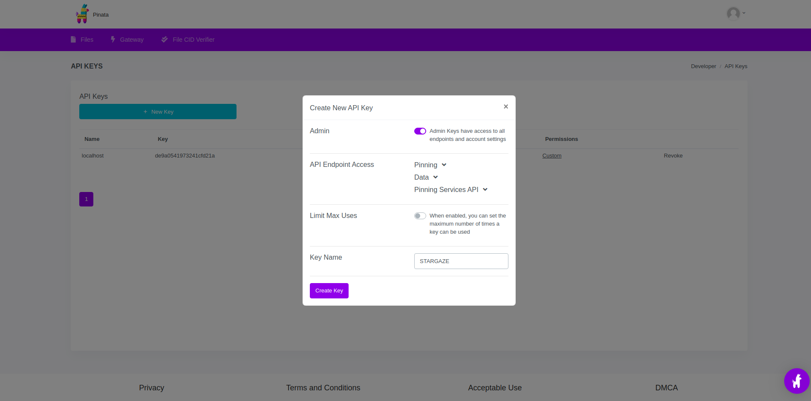
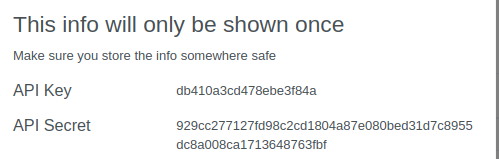

# Pinata Upload

In this guide, we'll be using [Pinata](https://www.pinata.cloud/) to upload NFT project files to IPFS.

## Get Pinata Account and API Keys

Create a Pinata account. The sign up page can be found here: [_Sign Up_](https://pinata.cloud/signup)_._

Go to the [API keys page](https://app.pinata.cloud/keys), and click the "New Key" button. Give the key a name and select "create".



This will create an API key pair for you. Take note of both the API Key and API Secret, you will need to add these to your `config.js` file.




## Setup Config.js

Open your `config.js` file in your favorite text editor and add the corresponding keys to `pinataApiKey` and `pinataSecretKey`. For example:

```
// Pinata API Key
  pinataApiKey: "",
  // Pinata Secret Key
  pinataSecretKey: "",
```

Make sure the rest of `config.js` is filled out according to your project needs. It's particularly important to note the _Collection Info_ section. This information will be used for generating metadata about your collection, and will control how it is displayed in the UI.

```
  //// COLLECTION INFO ////
  // The name of your collection
  name: 'Collection Name',
  // The 3-7 letter ticker symbol for your collection
  symbol: 'SYM',
  // Project description
  description: 'An awesome NFT series',
  // Path to image to use as the main image for the collection
  image: 'images/1.png'
```


NOTE: `image` here in the _Collection Info_ config is the image that is used when your collection is displayed in the UI. The `pinata-upload` script will upload this image to IPFS for you.


## Upload Files To IPFS

After filling out your config, and double checking all the details, you're now ready to upload your project to IPFS! Simply run:

```
yarn run pinata-upload
```

This will output a `baseTokenUri`. Be sure to add it to your `config.js` file.

With your assets uploaded to IPFS, you are now ready to deploy your smart contracts.
