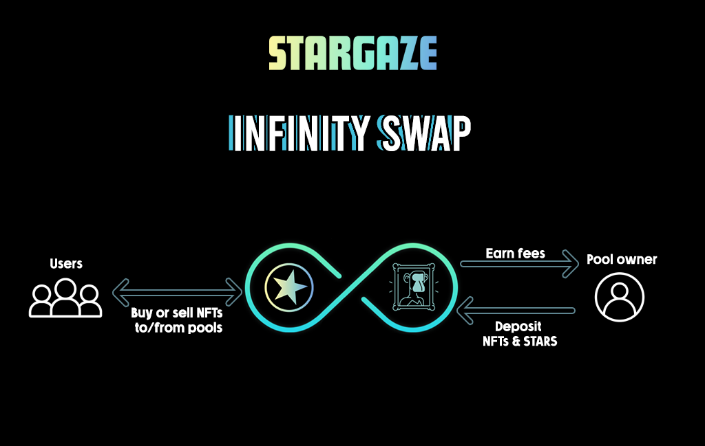

# ♾ Infinity Swap

### Introduction

**Infinity Swap** is an **NFT AMM protocol.**

You can earn swap fees by providing liquidity through your own trade pools. Every time someone sells or buys an NFT, you earn a swap fee.

By creating an Infinity Pool, you become the market maker.

Infinity consists of 2 parts:

* Infinity Pools
* Infinity Swap

<figure><figcaption></figcaption></figure>

**Infinity Pools** are the building blocks of the **Infinity Swap** protocol:

* Each pool belongs to a single account and pertains to a specific collection. (For example, a pool for Bad Kids, another for Pixel Wizards, etc).
* Anyone can create pools, of any collection.
* You can create pools with specific parameters and deposit STARS and NFTs into them.
* The pool creator can deposit and withdraw assets from the pool at any time.
* You can also select the bonding curve that will determine the price at which the pool buys or sells NFTs.

**Infinity Swap** also has an interface that allows you to swap NFTs and STARS seamlessly.

* Traders can either:
  * Select an amount of STARS and swap that to NFTs for a given collection.
  * Select a number of NFTs from a given collection and swap those into STARS.
* Infinity Swap will utilize the pools other people created to make those swaps. (Swapping with the pools instead of with users like on Marketplace)
* The smart contracts will route the trade requests to the pools with the best prices at that time.

Infinity CosmWasm contracts have been audited by OtterSec and Oak Security:\
\- [Ottersec Audit](https://github.com/public-awesome/audits/blob/main/infinity-swap/2023-04-12%20Otter%20Sec%20Audit.pdf)\
\- [Oak Security Audit](https://github.com/public-awesome/audits/blob/main/infinity-swap/2023\_07\_20\_Audit\_Report\_Stargaze\_Infinity\_Pool\_Re\_audit\_v1\_0.pdf)
