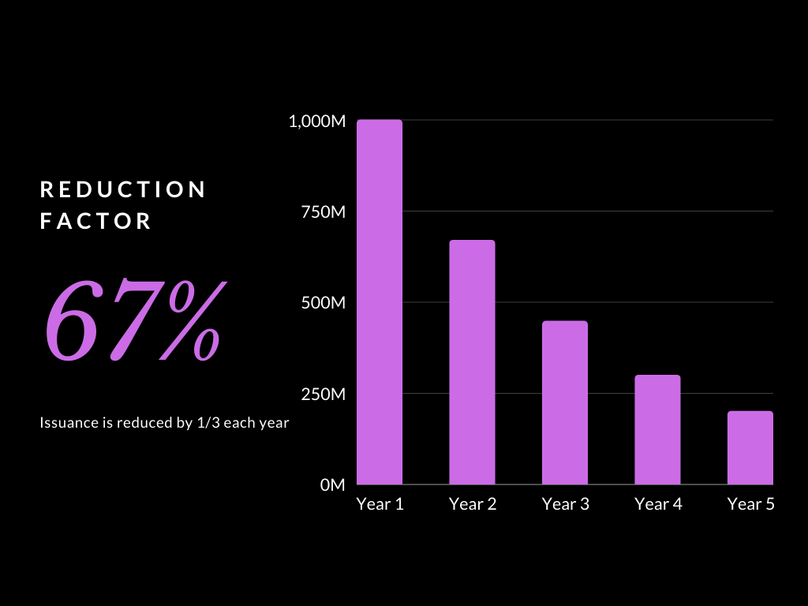

# Tokenomics

The distribution of STARS is designed to front-load inflation in order to bootstrap the network. This is a similar issuance schedule to Bitcoin. However, instead of halvings, issuance is cut by 1/3 each year (by multiplying the current issuance by a reduction factor of 2/3). Osmosis was the first protocol to use a [“thirding” token release schedule](https://medium.com/osmosis/osmo-token-distribution-ae27ea2bb4db) and heavily inspired Stargaze’s design.

<figure><figcaption></figcaption></figure>

More details:




Stargaze had a tokenomics update to cut inflation and supplement staking rewards from the community pool. The new maximum supply is 3 billion STARS.

